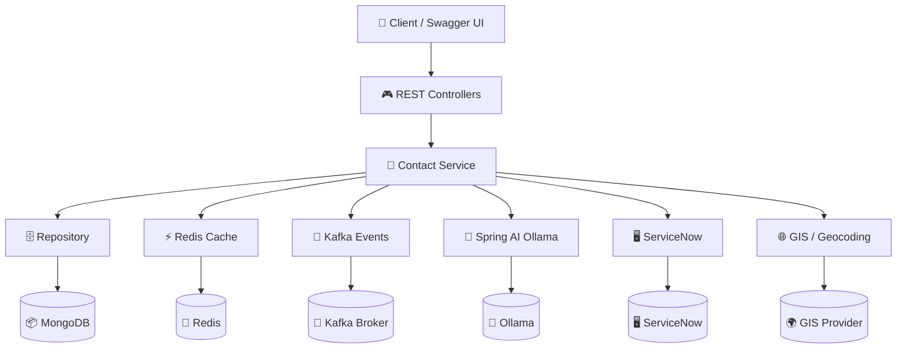

# 🚀 Contact Management System (CMS)


> **A high-performance, feature-rich Contact Management API** built with Spring Boot 3.x, MongoDB, Redis, Kafka, and Spring AI. Designed around a clean service layer, MapStruct mapping, strong validation, caching, event-driven architecture, geospatial queries, and first-class test coverage.

---

## Table of Contents

- [About the Project](#about-the-project)
- [Key Features](#key-features)
- [Tech Stack](#tech-stack)
- [Architecture Overview](#architecture-overview)
- [API Quick Reference](#api-quick-reference)
- [Getting Started](#getting-started)
- [Configuration](#configuration)
- [Running Tests](#running-tests)
- [CI/CD & Monitoring](#cicd--monitoring)
- [Contributing](#contributing)
- [License](#license)

---

## About the Project

The Contact Management System is a **production-ready backend** for storing, searching, and interacting with contacts at scale. It goes beyond simple CRUD with geo-location, rich profile data (multiple phones/emails/groups), caching, event streaming, AI integration placeholders, and interactive API docs.

---

## Key Features

<table>
  <thead>
    <tr>
      <th>Feature</th>
      <th>Description</th>
    </tr>
  </thead>
  <tbody>
    <tr>
      <td>📝 <b>Full CRUD</b></td>
      <td>Create, read, update, and delete contacts with standardized <code>ApiResponse</code> wrappers.</td>
    </tr>
    <tr>
      <td>🔍 <b>Advanced Search</b></td>
      <td>Free-text search across name, email, company, city, etc., plus filters for company, city, group, and favorite status.</td>
    </tr>
    <tr>
      <td>📑 <b>Pagination & Sorting</b></td>
      <td>Cursor-friendly <code>Pageable</code> support for all list endpoints.</td>
    </tr>
    <tr>
      <td>🌍 <b>Geolocation & Nearby</b></td>
      <td>Geo-indexed <code>Point</code> field enables radius-based "contacts nearby" lookups.</td>
    </tr>
    <tr>
      <td>👥 <b>Rich Contact Model</b></td>
      <td>Multiple phone numbers, multiple email addresses, groups, favorites, profile photo URL, and birthday.</td>
    </tr>
    <tr>
      <td>🛡️ <b>Data Integrity</b></td>
      <td>Bean Validation (Jakarta), unique email/mobile checks, and MongoDB unique indexes.</td>
    </tr>
    <tr>
      <td>⚡ <b>Caching</b></td>
      <td>Spring Cache with <code>@Cacheable</code> / <code>@CacheEvict</code> backed by Redis (configurable).</td>
    </tr>
    <tr>
      <td>📡 <b>Event-Driven</b></td>
      <td>Publishes <code>CREATED</code>, <code>UPDATED</code>, <code>DELETED</code> events to Kafka for downstream consumers.</td>
    </tr>
    <tr>
      <td>🤖 <b>AI Ready</b></td>
      <td>Spring AI Ollama ChatClient configured with sensible defaults for future smart features.</td>
    </tr>
    <tr>
      <td>📚 <b>Interactive Docs</b></td>
      <td>SpringDoc OpenAPI lives at <code>/swagger-ui.html</code> for API exploration.</td>
    </tr>
    <tr>
      <td>🔐 <b>Security Ready</b></td>
      <td>Spring Security + JJWT on the classpath; structured for JWT auth & role-based access.</td>
    </tr>
    <tr>
      <td>📊 <b>Observability</b></td>
      <td>Spring Boot Actuator + Micrometer Prometheus for health, metrics, and monitoring.</td>
    </tr>
    <tr>
      <td>🧪 <b>Well Tested</b></td>
      <td>JUnit 5 + Mockito unit tests covering creation, update, duplicates, pagination, search, and delete paths.</td>
    </tr>
    <tr>
      <td>🎂 <b>Birthday Reminders</b></td>
      <td>Dedicated endpoint returning upcoming birthdays from the contact store.</td>
    </tr>
    <tr>
      <td>📤 <b>Profile Photos</b></td>
      <td>Multipart upload endpoint to attach a profile photo to a contact.</td>
    </tr>
    <tr>
      <td>🖥️ <b>ServiceNow Integration</b></td>
      <td>Bidirectional sync with ServiceNow for incident management, service catalog, and ITSM automation.</td>
    </tr>
    <tr>
      <td>🌐 <b>GIS & Geocoding</b></td>
      <td>Advanced GIS capabilities for address validation, reverse geocoding, and spatial analytics.</td>
    </tr>
  </tbody>
</table>

---

## Tech Stack

<table>
  <thead>
    <tr>
      <th>Category</th>
      <th>Technology / Library</th>
    </tr>
  </thead>
  <tbody>
    <tr>
      <td><b>Language</b></td>
      <td>Java 21</td>
    </tr>
    <tr>
      <td><b>Framework</b></td>
      <td>Spring Boot 3.5.16</td>
    </tr>
    <tr>
      <td><b>Database</b></td>
      <td>Spring Data MongoDB</td>
    </tr>
    <tr>
      <td><b>Cache</b></td>
      <td>Spring Data Redis + Spring Cache</td>
    </tr>
    <tr>
      <td><b>Messaging</b></td>
      <td>Spring for Apache Kafka</td>
    </tr>
    <tr>
      <td><b>AI</b></td>
      <td>Spring AI Ollama Starter (1.1.0-M3)</td>
    </tr>
    <tr>
      <td><b>Security</b></td>
      <td>Spring Security, JJWT (0.12.6)</td>
    </tr>
    <tr>
      <td><b>Validation</b></td>
      <td>Jakarta Bean Validation</td>
    </tr>
    <tr>
      <td><b>API Docs</b></td>
      <td>SpringDoc OpenAPI UI (Swagger)</td>
    </tr>
    <tr>
      <td><b>Mapping</b></td>
      <td>MapStruct 1.6.3 + Lombok 1.18.40</td>
    </tr>
    <tr>
      <td><b>Observability</b></td>
      <td>Spring Boot Actuator, Micrometer + Prometheus</td>
    </tr>
    <tr>
      <td><b>Build Tool</b></td>
      <td>Apache Maven</td>
    </tr>
    <tr>
      <td><b>Testing</b></td>
      <td>JUnit 5, Mockito, Spring Security Test</td>
    </tr>
    <tr>
      <td><b>Dev Experience</b></td>
      <td>Spring Boot DevTools</td>
    </tr>
    <tr>
      <td><b>ITSM</b></td>
      <td>ServiceNow Integration</td>
    </tr>
    <tr>
      <td><b>Geospatial</b></td>
      <td>GIS Mapping & Geocoding Support</td>
    </tr>
  </tbody>
</table>

---

## Architecture Overview



**Layered design:**  
- **Controller** – thin HTTP layer, validation, & response wrapping.  
- **Service** – business logic, duplicate checks, caching annotations, event publishing.  
- **Mapper** – MapStruct for DTO ⇄ Entity conversions and null-safe updates.  
- **Repository** – Spring Data MongoDB with geo and unique constraints.  
- **Event / AI / Cache / ServiceNow / GIS** – cross-cutting concerns wired cleanly via Spring.

---

## API Quick Reference

| Verb | Path | Purpose |
|------|------|---------|
| `POST` | `/api/v1/contacts` | Create contact |
| `GET` | `/api/v1/contacts/{id}` | Get contact by ID |
| `GET` | `/api/v1/contacts` | List / Search contacts |
| `PUT` | `/api/v1/contacts/{id}` | Update contact |
| `DELETE` | `/api/v1/contacts/{id}` | Delete contact |
| `POST` | `/api/v1/contacts/{id}/profile-photo` | Upload profile photo |
| `GET` | `/api/v1/contacts/birthdays/upcoming` | Upcoming birthdays |

> **Search & filters** on `GET /api/v1/contacts`: `q`, `company`, `city`, `group`, `favorite`, `page`, `size`, `sort`.

---

## Getting Started

### Prerequisites

- Java 21+
- Maven 3.9+
- MongoDB (running on default port or configured)
- Redis (optional for caching)
- Kafka (optional for events)
- Ollama (optional for AI features)
- ServiceNow instance (optional for ITSM integration)
- GIS / Geocoding service (optional for advanced geo features)

### Install & Run

```bash
# 1. Clone the repository
git clone https://github.com/<your-username>/CMS.git
cd CMS/sys

# 2. Configure application properties
cp src/main/resources/application.yml.example src/main/resources/application.yml
# Edit application.yml with your MongoDB, Redis, Kafka, AI, ServiceNow, and GIS settings

# 3. Build the project
mvn clean install

# 4. Run the application
mvn spring-boot:run
```

The API will be available at **`http://localhost:8080/api/v1`** and Swagger UI at **`http://localhost:8080/swagger-ui.html`**.

---

## Configuration

Key properties (in `application.yml`):

```yaml
spring:
  data:
    mongodb:
      uri: mongodb://localhost:27017/cms
  redis:
    host: localhost
    port: 6379
  kafka:
    bootstrap-servers: localhost:9092
  ai:
    ollama:
      base-url: http://localhost:11434
      chat:
        model: qwen2.5-coder:1.5b
  servicenow:
    instance-url: https://<your-instance>.service-now.com
    client-id: <client-id>
    client-secret: <client-secret>
  gis:
    provider: google | here | openstreetmap
    api-key: <gis-api-key>
```

Features like caching, JWT secret, and actuator endpoints are toggled via profiles.

---

## Running Tests

```bash
mvn test
```

Or run only a specific test class:

```bash
mvn test -Dtest=ContactServiceImplTest
```

Coverage reports (JaCoCo) can be generated with:

```bash
mvn jacoco:prepare jacoco:report
```

---

## CI/CD & Monitoring

- **GitHub Actions** (workflows in `.github/workflows`) – build, test, and build Docker images.
- **Actuator endpoints** (`/actuator/health`, `/actuator/metrics`) ready for deployment health checks.
- **Prometheus + Grafana** metrics exposed for performance monitoring.

---

## Contributing

1. Fork the repo and create your feature branch:
   ```bash
   git checkout -b feature/amazing-feature
   ```
2. Commit your changes with clear messages.
3. Push to the branch and open a Pull Request.
4. Ensure all tests pass (`mvn clean test`) and follow the project’s code style.

---

## License

Distributed under the MIT License. See <a href="LICENSE">LICENSE</a> for more information.

---

## 👨‍💻 Author

Built with ❤️ by Madan Patel H S.

*Happy coding!* 🚀
